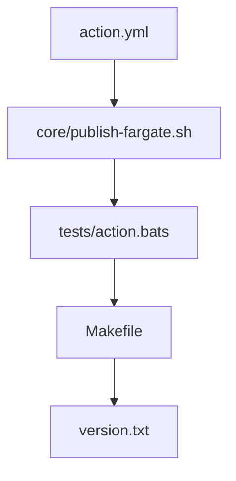

# 🚀 action-fargate-publish — Trigger a new ECS Fargate deployment by forcing a rolling update on an existing service.

[](https://github.com/heronlabs/action-fargate-publish/actions/workflows/continuous-integration.yml)

> Trigger a new ECS Fargate deployment by forcing a rolling update on an existing service.

Authenticates to AWS via OIDC and runs `aws ecs update-service --force-new-deployment`. Use it after pushing a new image so the service picks up the tag its task definition references.

## Contents

- [Usage](#usage)
- [Inputs](#inputs)
- [Outputs](#outputs)
- [Permissions](#permissions)
- [Architecture](#architecture)
- [How it works](#how-it-works)
- [Notes](#notes)
- [License](#license)

## Usage

```yaml
name: Deploy to Fargate

on:
  push:
    branches: [main]

permissions:
  id-token: write
  contents: read

jobs:
  deploy:
    runs-on: ubuntu-24.04
    steps:
      - uses: actions/checkout@v7

      - name: Rolling deploy
        uses: heronlabs/action-fargate-publish@v3
        with:
          AWS_ROLE_TO_ASSUME: ${{ secrets.AWS_ROLE_ARN }}
          AWS_REGION: us-east-1
          AWS_ROLE_DURATION_SECONDS: 900
          CLUSTER_NAME: my-cluster
          SERVICE_NAME: my-service
```

## Inputs

| Name | Description | Required | Default |
|------|-------------|----------|---------|
| `AWS_ROLE_TO_ASSUME` | ARN of the IAM role to assume via OIDC. | Yes | — |
| `AWS_REGION` | AWS region where the ECS cluster lives. | Yes | — |
| `AWS_ROLE_DURATION_SECONDS` | Duration in seconds for the assumed role session. | Yes | — |
| `CLUSTER_NAME` | Name of the ECS cluster hosting the service. | Yes | — |
| `SERVICE_NAME` | Name of the ECS service to redeploy. | Yes | — |

## Outputs

This action produces no outputs.

## Permissions

```yaml
permissions:
  id-token: write
  contents: read
```

<details><summary>AWS IAM policy</summary>

The assumed role must allow updating the target service:

```json
{
  "Version": "2012-10-17",
  "Statement": [
    {
      "Effect": "Allow",
      "Action": "ecs:UpdateService",
      "Resource": "arn:aws:ecs:<region>:<account-id>:service/<cluster-name>/<service-name>"
    }
  ]
}
```

</details>

## Architecture



## How it works

Composite action with a single shell script (`core/publish-fargate.sh`):

1. **Validate inputs** — `CLUSTER_NAME` and `SERVICE_NAME` must be set; the script fails fast with an error if either is missing.
2. **Force new deployment** — runs `aws ecs update-service --cluster CLUSTER_NAME --service SERVICE_NAME --force-new-deployment` to trigger AWS ECS to redeploy the service with the image tag its current task definition references.

## Notes

- Forces a rolling redeploy; it does NOT change the task-definition image tag. Update the task definition separately to deploy a new tag, typically after `heronlabs/action-ecr-publish@v3`.
- Hard-fails if `CLUSTER_NAME` or `SERVICE_NAME` is missing.
- OIDC only — no long-lived access keys.

## License

MIT
